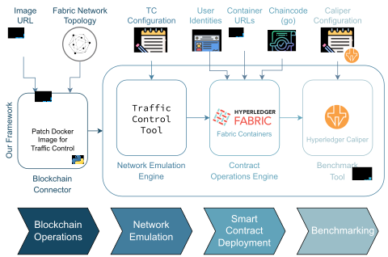

# Deployment and Benchmarking Framework for Hyperledger Fabric Smart Contracts

This repository contains a PoC for a Python framework that can be used for deploying locally a custom topology of Hyperledger Fabric network (with TLS enabled) and launching a benchmark using the Hyperledger Caliper tool.

The scope is to allow the user to easily deploy a custom topology of Hyperledger Fabric network and to launch a benchmark using the Hyperledger Caliper tool, without having to manually configure the network and the benchmark configuration files.

Moreover, the repository contains modified Hyeprledger Fabric images that add the support for Traffic Control (TC) and Network Emulation (NETEM) to the peer and orderer nodes. This allows to simulate different network conditions and to benchmark the blockchain network under different network conditions.

The final goal is to provide a framework that can be used to benchmark the performance of a blockchain network under different network conditions, including the production network conditions.

**Disclaimer**: this repository is a work in progress for research purposes. It is not intended to be used in production. Use it at your own risk. The authors are not responsible for any damage caused by the use of this software. The code is intended to run on a Linux machine.


## Overview

The folder structure of this repository is as follows:

- `app`: contains the Python code for the application that will deploy the blockchain network and launch the benchmark
- `caliper`: contains the caliper benchmarking tool configuration files
- `fabric`: contains the fabric network configuration files and binaries
- `launcher`: contains the python code for the launcher that will deploy the blockchain network and launch the benchmark using the target benchmark configuration files

A picture of the framework is shown below:

<p align="center">
    
</p>

The framework is composed of the following components:

- The blockchain connector, that is responsible for deploying a Hyperledger Fabric network.
- The network emulator, that is responsible for emulating a network with different network conditions and is based on the Linux Traffic Control (TC) tool. The network emulation is provided by the Hyperledger Fabric images with TC and NETEM support. These images are based on the official Hyperledger Fabric images and add the support for TC and NETEM to the peer and orderer nodes. Instructions on how to build these images are provided in the Setup section.
- The contract operations engine, that is responsible for deploying the chaincode.
- The benchmark tool, that is responsible for launching the benchmark and consists in the Hyperledger Caliper tool.

Everything is glued together by the Python application, that will orchestrate the deployment of the blockchain network, the deployment of the chaincode, the network emulation and the benchmark execution.

The Python application can be run **as-is** to launch a single benchmark, or it can be used together **with the launcher** to launch multiple benchmarks with different configurations.

## Setup

### Prerequisites

- A working Docker instance, with your user belonging to `docker` group.

- A working Go installation.

- A working Python 3 installation, and the required dependencies installed:

  ```bash
  pip3 install -r requirements.txt
  ```

### Download binaries and Docker images

Donwload the Hyperledger Fabric install script or use the one provided in `fabric/install-fabric.sh`:

```bash
curl -sSLO https://raw.githubusercontent.com/hyperledger/fabric/main/scripts/install-fabric.sh && chmod +x install-fabric.sh
```

Use the script to download the binaries and the Docker images of *Fabric v2.4.7* and *Fabric CA v1.5.5*:

```bash
./install-fabric.sh --fabric-version 2.4.7 --ca-version 1.5.5 binary docker
```

### Build Fabric images with TC and NETEM support

Please refer to the [README](fabric/fabric-containers-tc/README.md) in the `fabric/fabric-containers-tc` folder for instructions on how to build the Fabric images with TC and NETEM support.

These images are required to run the benchmark with network emulation.


## Usage

For a single run, it is possible to launch the Python application `app/main.py` directly.
For multiple runs, it is recommended to use the launcher `launcher/main.py`.

In any case, the Hyperledger Caliper configuration files must be placed in `caliper/workspace/benchmarks` directory before launching the application.
In particular, based on the smart contract you want to deploy, you need to provide:

- `caliper/workspace/benchmarks/workloads/*.js`: the workload files that will be used by Caliper to run the benchmark (see the [Workload Configuration | Hyperledger Caliper](https://hyperledger.github.io/caliper/v0.5.0/workload-module/) for more information)

- `caliper/workspace/benchmarks/default.yaml`: the benchmark configuration file that will be used by Caliper to run the benchmark (see the [Benchmark Configuration | Hyperledger Caliper](https://hyperledger.github.io/caliper/v0.5.0/bench-config/) for more information)

These files are necessary for Caliper to be able to run the benchmark against the deployed chaincode.

This repository already contains an example workload file and an example benchmark configuration file that target the `HyperWatchdog` smart contract, that is a chaincode developed for an industrial use case (see [ecs-lab/hyperwatchdog](https://gitlab.com/ecs-lab/hyper-watchdog) for more information).


### Single run

For a single run, you can either launch the Python application `app/main.py` directly (not recommended), or use it as a CLI application.

Before launching the Python application directly you should edit the `app/main.py` file to set the desired parameters. on the other hand, when using it as a CLI application you can pass the parameters as command line arguments.

The CLI application accepts the parameters for building the Hyperledger Fabric network as command line arguments, and the help message can be printed at any time by running `python main.py --help`:

```terminal
$ python main.py --help

usage: HyperBenchmarker [-h] [--hosts] [--interactive] [--not-interactive] [-t THROUGHPUT] [-d DELAY] [-j JITTER] [-l LOSS] [--n-orgs N_ORGS] [--n-peer-per-org N_PEER_PER_ORG] [--n-orderers N_ORDERERS]
                        [--starting-port STARTING_PORT] [--smart-contract-name SMART_CONTRACT_NAME] [--smart-contract-path SMART_CONTRACT_PATH] [--smart-contract-ver SMART_CONTRACT_VER]

Deploy a Hyperledger Fabric Network, run a Chaincode and perform a benchmark.

optional arguments:
  -h, --help            show this help message and exit
  --hosts               Generate the hosts file and exit
  --interactive         Generate the hosts file and exit
  --not-interactive     Generate the hosts file and exit
  -t THROUGHPUT, --throughput THROUGHPUT
                        Network: Max throughput in mbit/s
  -d DELAY, --delay DELAY
                        Network: Delay in ms
  -j JITTER, --jitter JITTER
                        Network: Jitter in ms
  -l LOSS, --loss LOSS  Network: Loss in percentage 0-100
  --n-orgs N_ORGS       Number of Fabric organizations
  --n-peer-per-org N_PEER_PER_ORG
                        Number of Fabric peers per organization
  --n-orderers N_ORDERERS
                        Number of Fabric orderers
  --starting-port STARTING_PORT
                        Starting port for the Fabric network
  --smart-contract-name SMART_CONTRACT_NAME
                        Smart contract to deploy
  --smart-contract-path SMART_CONTRACT_PATH
                        Path to the smart contract to deploy
  --smart-contract-ver SMART_CONTRACT_VER
                        Version of the smart contract to deploy
```

The `--hosts` option will generate the `hosts` file that must be used by your DNS server to resolve the hostnames of the nodes in the network. When using Linux, the content should be appended to `/etc/hosts`.

The benchmark report will be saved in `caliper/workspace/report.html`.

### Multiple runs

The laucher can be used to launch multiple benchmarks with different configurations.

First, you have to provide one or more benchmark configuration files in `launcher/configs` directory. An example is provided in `launcher/configs/example.yaml`.
The YAML file must contain the following fields:

- `benchmark`: contains the configuration for the benchmark tool Hyperledger Caliper, that must be written as explained in [Benchmark Configuration | Hyperledger Caliper](https://hyperledger.github.io/caliper/v0.5.0/bench-config/).

- `launcher`: contains the configuration for the framework, including the `fabric` section that defines the configuration for the Hyperledger Fabric network, the `network` section that defines the network emulation parameters, and the `smart_contract` section that defines the smart contract to deploy. These parameters are the same as the ones accepted by the Python application `app/main.py`, described in the previous section.

Then, you can launch all the benchmarks sequentially by running the launcher as follows:

```bash
python3 launcher/main.py
```

The benchmark reports will be saved in `launcher/results` directory.

An example script for generating multiple benchmark configuration files is provided in `launcher/configs_gen.py`. The script will generate a benchmark configuration file for each combination of the parameters defined in the script itself.


## Troubleshooting

If using a Python virtual environment, you may need to run `sudo usermod -aG docker ${USER} && newgrp docker` to make the virtual environment work with Docker.
Otherwise, the virtual environment will not be able to run Docker commands neither inside Python scripts nor from the command line.
To check that the user has enough permissions to run Docker, run `docker run hello-world`.

Also, make sure that the `go` executable is in the `PATH` environment variable: `export PATH=$PATH:/usr/local/go/bin`.

To persist these settings in a Python virtual environment, you can directly patch its `bin/activate` script by adding:

```bash
# Add the user to `docker`` group to run docker commands without sudo
sudo usermod -aG docker ${USER}

# Make the go binaries available to the user
export PATH=$PATH:/usr/local/go/bin
```

If using Docker Desktop, the `app/container.py` file must be patched such that the user running every container is the default chosen by Docker.
When using Docker CE, instead, the provided software will work out of the box, running the containers as the current user.

## Examples

This repository contains some examples of benchmark configuration files in `launcher/configs` directory. The run results are available in `launcher/results` directory. The analysis of the results is available in the `data_analysis` folder.